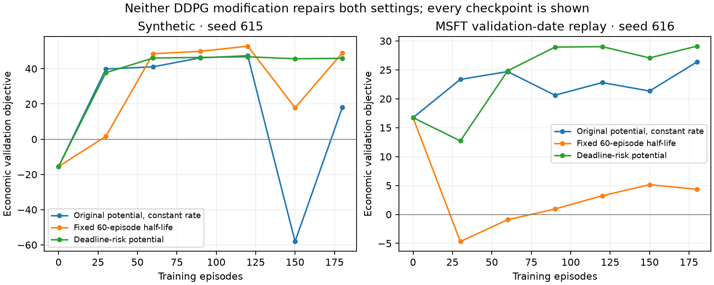

> Historical audit before the author approved the weighted objective. Its rejected trials remain evidence; active settings and conclusions are superseded by [the v16 report](objective_repair_v16.md).

# Calibration and learning follow-up — 5 September 2026

The v15 development results establish positive selected-policy means; they do
**not** establish an empirically calibrated market, consistent historical
superiority, convergence, or a material unconditional auction benefit. This
follow-up supersedes the calibration endorsement in the first repair report.
Neither protected TeX file has been edited.

## What k-star, q and beta mean

These parameters should not all be described as market estimates. k-star and
q specify training preferences. Beta specifies the numerical resolution and
maximum exposure of an admissible auction supply schedule. Its physical unit
is inventory units per price unit, because executed quantity is K times a
price difference. Lambda has units price per inventory unit. The mapping of
an inventory unit to shares or lots must be stated before comparison with
observed depth or volume.

For an executed CLOB unit with price S and a small positive indicative gap
g=H-S below k-star times alpha, the shaping deduction is S*g/(k-star*alpha).
The economically relevant coefficient is therefore S/(k-star*alpha), not
k-star in isolation. At S0=100:

| Quantity | Active v15 | Illustrative execution-scale alternative |
|---|---:|---:|
| alpha | .05 | .01 |
| Best modeled quoted spread, 2 alpha/S0 | 10 bps | 2 bps |
| k-star | 100,000 | 10,000 |
| Gap at which the CLOB reward vanishes | 5,000 price units | 100 price units |
| CLOB shaping deduction per unit price gap at S0 | .02 | 1 |
| q | 0 | 0 |
| beta | .002 | 1 |
| Maximum slope per schedule, 32 beta | .064 | 32 |
| Nominal quantity at a ten-tick local price gap | .032 | 3.2 |
| Nominal quantity across 30 such schedules | .96 | 96 |

The nominal quantities are dimensional diagnostics, **not hard execution
bounds**: indicative-price motion, tick rounding, persistent orders, endogenous
clearing and pro-rata allocation all matter. For example, actual v15 mean
auction fills can slightly exceed .96.

The v15 k-star means that an indicative gap must reach 50 times the initial
price before the clipped multiplier vanishes. It nearly removes the dollar
opportunity-cost penalty; describing it as a realistically tolerated price
gap is indefensible. k-star=S0/alpha is an interpretable *preference*: one unit
of forgone expected sale price generates approximately one unit of shaping
deduction at S0. It is not an empirical estimate of risk aversion, and the
zero-reward threshold remains very large because the multiplier acts on
gross principal. If the paper intends k-star*alpha itself to be a small market
tolerance, its current multiplicative reward form needs reconsideration.

q=0 is defensible as a no-purchase-subsidy reference preference. q=.5 credits
half the negative fictive cash component back; q=1 fully neutralizes it, and
the terminal purchase term also subsidizes actual purchases in J. No such
subsidy enters economic evaluation. Crucially, q=0 does not remove the
positive fictive credit for selling.

Beta=.002 is numerically fine enough to control very small residual inventory,
but its maximum exposure is inadequate for material liquidation of a
100-unit parent. Beta=1 at alpha=.01 gives a .01-unit quantity increment at
a one-tick gap and 3.2 units per maximum-slope, ten-tick schedule. That is an
interpretable grid relative to I0=100. It is **not yet an empirically fitted
auction-liquidity calibration**. The draft slope support [1,20] is likewise
an illustrative sensitivity choice, not an estimate.

The reusable dimensional audit is:

```sh
.venv/bin/python -m lmm.experiments.calibration \
  --config configs/base.yaml --config configs/synthetic_rough_heston.yaml
```

## What the observed quotes support

The frozen quote sidecar records selected-quote spread statistics. Computing
the median of the daily medians on the ten **training dates**, August 3–14,
gives CAT 5.6275 bps, GOOGL .8679, JPM 2.0769, MSFT 1.4095 and PG 1.3842.
The full sidecar was inspected during exploration, but these reported
calibration statistics use the training partition only. The reproducible
[training-only extract](verification_followup/training_quote_spreads.csv)
and [source hash and dates](verification_followup/quote_provenance.json) are
saved separately. The 10-bp modeled spread is materially wider than these
training medians. A shared 2-bp spread is closer, though it cannot reproduce
the five stocks' different spread distributions.

Historical paths are rebased to S0=100. Thus alpha=.01 is a **model-coordinate
tick**, not necessarily one raw-price U.S. cent for every stock and day. Do
not justify alpha=.05 as the ordinary tick of these large-cap stocks. Also,
the SEC delayed implementation of its amended minimum-tick requirements to
the first business day of November 2026; the earlier November 2025 deadline
is obsolete as of this audit. [SEC order dated October 31, 2025](https://www.sec.gov/files/rules/exorders/2025/34-104172.pdf).

Quote snapshots and midpoint paths cannot identify the simulator's full
depth shape, market-order intensity, auction slope support or supply-demand
response. Actual auction imbalance, matched-volume and price-sensitivity
data would be needed for an empirical auction calibration. The current
historical setting remains historical **midprice replay with simulated order
flow**, as specified by the model.

## Why a larger beta alone fails

Near a flat final auction price S, sell a small additional quantity z after
CLOB inventory has reached zero. Cash received and the negative residual
inventory mark cancel the principal. Ignoring price impact in this local
argument, the economic increment is -lambda*z², whereas the fictive auction
credit makes the shaped increment S*z-lambda*z². Small economically harmful
oversales are rewarded. q does not enter this positive-sale example; k-star
affects only CLOB rewards. At S=100 and lambda=.5, the unconstrained local
stationary point is z=100. This is a local diagnostic, not a claim that a full
equilibrium or finite-grid optimal policy always oversells 100 units.

Actual simulator probes corroborate the conflict. With alpha=.01, beta=.1,
exogenous slope support [1,20], k-star=10,000, q=0 and lambda=.5, a feasible
policy first liquidates at the best ask and then submits maximum slopes at
offset -10 during all auction slots. Across 16 common paths it opens the
auction with mean inventory .645 and sells another 9.191 units. Its mean
economic objective is **-43.277**, while shaped J is **915.335**. The otherwise
identical no-order auction gives economic objective **1.656**. This uses
actual endogenous clearing and settlement, not the price-taking approximation.

The learned literal-J diagnostic in that setting is also unfavorable:
DQN selected-policy economic mean -5.111 and TD3 -38.075, versus AS 8.430.
TD3's mean training J rises from about 359 in its first 30 episodes to 846
in its final 30. Increasing shaped reward therefore cannot be taken as
evidence of improving economic control. The diagnostic also changed the
learning-rate schedule and potential; it is not a clean single-parameter
causal comparison. The fixed-action counterexample isolates the incentive.

## The auction's conditional role is real

The unconditioned expected CLOB buy flow is about 397.25 units over 120
minutes: lambda0*tau_op times E[min(Pareto(2,2.5),30)]. This is almost four
times the initial 100 units, before accounting for competition and quote
placement. Substantial early liquidation is unsurprising.

Using fixed *feasible diagnostic policies* to leave 0, 10 or 20 units for the
auction shows how its contribution depends on that exposure. These are not
restrictions imposed on trained policies. At the wider auction grid above,
submitting all schedules rather than none changes the economic objective by
-44.933, +45.691 and +136.666, respectively. The same extra sale that creates
an oversale after CLOB liquidation reduces inventory risk when a position
remains. At the tiny v15 grid, the corresponding gains are only +.146,
+9.140 and +18.206, with mean auction fill .914.

This establishes a conditional risk-reduction role, not a large learned
unconditional contribution or evidence that reservation is optimal. Report
opening inventory, signed auction fill, economic PnL change and quadratic
risk change together. The diagnostic runner now records auction-opening
inventory explicitly. Its same-CLOB auction-noop comparison measures the
contribution of the selected auction controller conditional on that CLOB
policy. A separately retrained no-auction treatment answers a different
question about the full policy's response to losing auction access.

Nasdaq reports that the Closing Cross represented 17% of Nasdaq volume in
2025. That market-wide fraction does not imply that a particular liquidation
parent should reserve 17%. [Nasdaq Closing Cross, dated 2025 statistic](https://www.nasdaq.com/products/north-american-markets/nasdaq-stock-market/closing-cross).
The model's sequential 30-minute call with frozen midprice is stylized:
NYSE describes different order-entry cutoffs and concentration of late
D-order submissions. Do not interpret the simulated call as a literal replay
of NYSE's closing process. [NYSE auction timing study](https://www.nyse.com/research/insights/nyse-closing-auction-timing-shifts-and-marketability-trends).

## DDPG's late regression and the rejected learning changes

In the existing synthetic DDPG run, episode 120 has PnL 47.562 and economic
objective 47.363. At episode 150, PnL stays at 47.282 but economic objective
falls to -58.105. Mean CLOB execution falls from 99.433 to 91.976; the mean
inventory penalty rises from .200 to 105.386. Auction fills stay near .9.
The tail of residual inventory, rather than a cash-accounting error or a
nonfinite critic loss, explains this collapse. The phase boundary and the
late inventory penalty make the learning problem difficult.

A fixed learning-rate half-life of 60 episodes, with a .1 floor, was tested
on the same seeds, architectures and market calibration in both settings.
It changes no SB3 loss or update rule. The selected synthetic economic mean
improves from 43.180 to 47.502, but the historical mean deteriorates from
28.111 to **5.393**, against AS 33.413. It also leaves a synthetic validation
drop at episode 150. Consequently the schedule remains **disabled** in the
headline. The implementation is retained as an explicit reproducible option.

A second bounded check keeps the rate constant and changes only the
training potential in the CLOB: subtract
lambda*max(I-I0*(1-t/tau_op),0)^2. It is zero initially, matches the ordinary
auction inventory-risk potential at opening without outstanding own
schedules, and still telescopes to the same complete J. This exposes
deadline risk earlier without changing fees, actions or the objective. It
raises the historical selected economic mean to 29.170, but lowers the
synthetic mean to 39.776, below AS 41.023. It too remains disabled. This
rejects the tested heuristic; it does not prove all state potentials fail.



Economic validation selection protects the reported policy from a later bad
checkpoint; it is not evidence that continued training converges. Mixed
historical rankings are not themselves proof of an implementation defect:
AS is a strong stylized liquidation rule, while the learners face partial
observations and a different shaped training criterion. No result here
justifies requiring all algorithms to dominate AS in every setting.

## Optional model correction, not adopted

The [concrete reward proposal](proposed_reward_correction.md) and
[unapplied exact TeX patch](proposed_auction_weight.patch) multiply fictive
auction credits by omega_a=alpha/S0, including the original credits used for
cancellation clawbacks. Actual cash, fees, inventory risk, admissibility and
clearing are unchanged. Omega_a=1 is the literal manuscript J. The alternative
changes training policy rankings and requires the author's explicit decision.
The patch uses omega_a to avoid confusion with the paper's cancellation
indicator theta; early diagnostic names called this J_theta.

At alpha=.01 and S0=100 the proposed weight is .0001. A fictive sale then
earns roughly one tick per unit, instead of a full extra share price. This
reduces the problematic incentive; it is not a proof of objective equivalence.
The draft simultaneously uses lambda=.05, beta=1 and slope support [1,20],
so comparisons with other drafts cannot isolate the weight's learning effect.
On fresh development seed 617 the selected DQN and TD3 economic means are
2.175 and 5.694, respectively, against AS 8.804 and TWAP 3.217. Both are
positive, but auction-noop differences remain negative. These results do
**not** establish a solution and the draft is not promoted to the headline.

For the protected parameter table, the optional patch specifies exactly
q=0, k-star=10,000, lambda=.05, U1=1, U2=20 and omega_a=.0001; alpha=.01
and beta=1 would retain the original manuscript values. This is a candidate
stylized setting requiring further validation, not a recommendation to claim
empirical realism. The earlier unapplied v15 patch remains useful as an exact
record of code/paper differences, but its numerical substitutions should not
be adopted as an empirically calibrated publication specification.

## Evidence and reproduction

[Summary means](verification_followup/summary.csv),
[every validation checkpoint](verification_followup/validation.csv),
[feasible-policy records](verification_followup/feasible_policy_records.csv)
and [run configurations, protocols and hashes](verification_followup/manifest.json)
retain favorable and unfavorable outcomes. Rebuild the summaries with:

```sh
MPLCONFIGDIR=/private/tmp/lmm_mpl .venv/bin/python scripts/summarize_calibration_followup.py
```

The eight completed follow-up learning checks total 1,440 training episodes.
Each uses 180 training episodes, validation every 30
on 64 fixed paths, and 128 fresh development confirmation paths after
maturity-gated economic checkpoint selection. Historical confirmation uses
the validation dates with new order-flow seeds, not new independent dates.
These are single-master-seed diagnostic comparisons; 128 episodes do not
measure variability across trained policies. No 800-episode production run
or final publication performance test was launched.

Provenance correction: the original `audit2` row labeled v15 inadvertently
used k-star=2000. Its other four configurations were correct. That v15 row is
excluded from the exported evidence and replaced by a rerun with k-star=
100,000 in `audit_v15_corrected`. The original raw outputs remain untouched.
Two failed diagnostic launches stopped before training (an action-index
lookup during the initial audit, and a misspelled historical config path).

The core suite passed 497 tests, with 23 network/slow tests deselected.
After adding the calibration audit edge-case guards and parameter-table
disclosure, the targeted integration suite passed 65 tests. It covers
weighted-credit accounting, exact clawbacks, objective-preserving potential
telescoping, SB3 checkpoint behavior, config rejection and table generation.
The subsequent deadline-potential and calibration guards passed 28 tests.
The final combined table, learning-repair and calibration check passed 41
tests after all code changes. Both protected-file SHA-256 hashes match the
originals, both unapplied patches pass `git apply --check`, and
`git diff --check` is clean.
