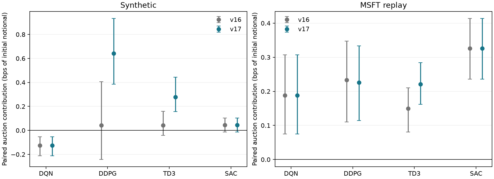
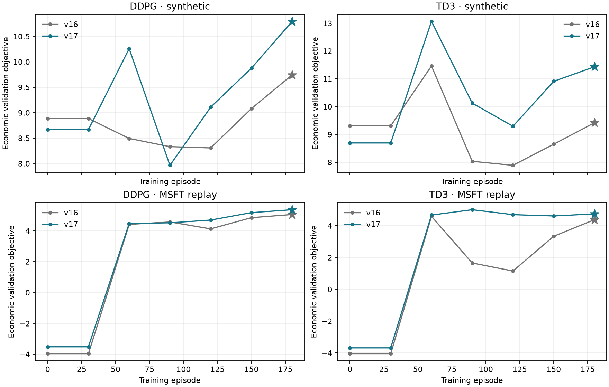

# Economic calibration and learning refinement

This follow-up improves DDPG and TD3 through observation conditioning while
preserving the v16 economic calibration, shaped training objective, native
SB3 update rules, action sets and actual settlement. It supplies a more precise
interpretation of k-star and the units of beta. Neither protected TeX file is
edited. The [v16 report](objective_repair_v16.md) remains the original repair
record; results from different evaluation cohorts should not be compared as
if they used the same paths.

## What changed and why

The two deterministic actor/critic methods fit separate CLOB and auction
normalization statistics on the same 16 dedicated training paths. Their
auction inventory I and continuous-root residual exposure R use

`asinh(I / I_s)` and `asinh(R / I_s)`, with `I_s=alpha/lambda=1`.

This scale is the quantity for which one-tick execution value equals the
quadratic inventory cost: `alpha*I_s = lambda*I_s²`. If lambda is zero the
implementation uses I0. The transform gives small positive and negative
positions more resolution while retaining large exposures. It is invertible
and unbounded. Actual inventory, signed fills, rewards and controls are
unchanged. The same raw 18 observations enter every method; no future
information or fitted benchmark action enters the transform. Time and decision
index retain their original normalization by tau_cl.

DDPG and TD3 keep their existing SB3 2.7.1 models, optimizer rates, network
sizes, replay budgets, gradient bounds and exploration rules. In particular,
TD3 still uses the library's two critics, delayed policy updates and target
smoothing. [SB3 documentation](https://stable-baselines3.readthedocs.io/en/v2.7.1/modules/td3.html).

The change is not made a universal default. The matched trials did not support
applying both transforms to DQN and SAC: DQN's synthetic economic mean changed
little but its auction contribution deteriorated; SAC improved synthetically
but regressed on MSFT replay. Their previous representations are retained.
The headline therefore compares specified algorithm implementations including
preprocessing, rather than isolating an algorithm-only causal effect.

Two supplementary overlays allow a matched representation comparison for all
four algorithms: [pooled linear](../configs/treatment/representation_pooled.yaml)
and [phase plus signed-asinh](../configs/treatment/representation_phase_asinh.yaml).
They alter neither the economics nor the optimizer settings. These controls
are additional bounded diagnostics, outside the current publication treatment
matrix; their labels distinguish them from headline artifacts.

## Fresh frozen-policy confirmation

After choosing the representation and checkpoints, both versions were evaluated
on **256 fresh common development paths per setting**, seed 1740926, without
learning or checkpoint reselection. The historical paths use only the five
MSFT validation dates, August 17–21. No final-test dates were consumed.
The selected primary pilots use 180 training episodes, with master seed 628
synthetically and 627 historically. All four learners have positive PnL and
exceed AS and TWAP on this fresh cohort.

| Method | Synthetic economic objective | Synthetic auction contribution | MSFT economic objective | MSFT auction contribution |
|---|---:|---:|---:|---:|
| DQN | 14.016 | -.126 | 5.754 | .188 |
| DDPG | 12.940 | .641 | 6.985 | .226 |
| TD3 | 12.300 | .278 | 6.240 | .221 |
| SAC | 12.102 | .044 | 6.983 | .326 |

Numbers are model price times inventory units, also basis points of the
10000-unit initial notional. Auction contribution holds the learned CLOB
policy fixed and compares its auction actions with no auction orders on the
same exogenous path. It is not the separately retrained no-auction treatment.

Relative to the v16 policy on these identical fresh paths, DDPG improves by
**1.230** synthetically, paired 95% interval **[.669, 1.741]**, and **.636**
historically **[.362, .910]**. TD3 improves by **.987** synthetically
**[.417, 1.678]** and **.228** historically **[-.078, .531]**. The last interval
does not establish a historical TD3 improvement despite its positive mean.

The new synthetic auction contributions have intervals **[.384, .933]** for
DDPG and **[.157, .443]** for TD3. DDPG's contribution consists of about .394
trading PnL and .247 reduced terminal risk; TD3's consists of .190 trading PnL
and .088 reduced risk. Neither gain was obtained by reducing lambda or fees,
requiring auction reservation, limiting signed fills, or imposing abstention.

DQN's remaining synthetic cost is **-.126**, interval **[-.212, -.052]**;
SAC's **.044** interval **[-.013, .103]** includes zero. These residual cases
are retained rather than described as universally profitable auction access.
All four historical auction intervals are positive. The interval calculations
resample paths conditional on fitted policies and the chosen historical dates;
they do not estimate population uncertainty over training seeds or stocks.



[Complete fresh records](verification_v17/frozen_records.csv),
[summary and paired intervals](verification_v17/frozen_summary.csv), and the
[active-config/checkpoint comparison](verification_v17/active_config_check.json)
make the comparison auditable. The checkpoint and normalization contracts
reject incompatible representations; the v16 DQN/SAC policies load only under
their saved compatible configurations.

## Learning behavior and second-seed check

DDPG's primary final validation scores at episodes 120/150/180 are
**9.11/9.88/10.80** synthetically and **4.69/5.17/5.36** historically.
The late collapse does not reappear in these bounded pilots. The full curves
retain earlier dips and TD3's nonmonotone behavior. No inference is made about
convergence at the 800-episode production cap.



A separate training seed, 8841, repeats the matched before/after comparison
without changing the settings. Its 128 common development paths show DDPG
improving from **10.996 to 11.284**, paired interval for the improvement
**[.073, .530]**. TD3 changes from **11.253 to 11.276** with interval
**[-.111, .153]**, effectively a tie. DDPG's auction contribution improves
from approximately zero to .283; TD3's remains positive at .275.
The [two-seed comparison](verification_v17/paired_training_seeds.csv) supports
DDPG's refinement and qualifies the strength of the TD3 claim. Two seeds are
not a reliable estimate of training-seed uncertainty.

The [attempt ledger](verification_v17/all_attempts.csv) contains all 16 bounded
pilots from this refinement. The
[all validation records](verification_v17/all_validation.csv) retain the
phase-only experiments, the unsuccessful DQN/SAC transfer, and both versions
of the second-seed runs. Development paths reused while selecting the
representation are distinguished from the final fresh confirmation.

A final phase-only DQN check, prompted by its residual cost on the fresh
cohort, was also rejected: on the earlier development paths its synthetic
auction contribution was -.180, versus -.080 with the retained v16 policy,
while its total economic objective was essentially unchanged. Its historical
auction result was positive. No new DQN setting was selected from the fresh
cohort. This leaves a small, explicitly measured DQN policy weakness; the
bounded experiments do not justify claiming that every auction controller is
economically beneficial.

## Why a smaller k-star is not automatically more defensible

**Yes, k-star=10000 is a dimensionless number of ticks.** At alpha=.01 its
clipping distance is 100 model-price units, equal to S0. It should not be
called a realistic tolerated market-price gap. That interpretation is not
supported by the data.

The manuscript's gross-proceeds formula couples that distance to the local
strength of the shaping deduction. Write p for the execution price, E for
executed quantity, g=(H-p)+ and

`eta_C = S0 / (k_star*alpha)`.

The exact CLOB training reward can be written as

`r_C = p*E - eta_C*(p/S0)*E*min(g, S0/eta_C)`.

Thus eta_C=1 means approximately one unit of price-gap deduction per unit
executed near S0. A one-tick gap deducts .01 per inventory unit; with k-star=100
the same gap deducts 1.00, one hundred times as much. Merely reducing the
displayed tick count would greatly strengthen the training preference.

The frozen-policy training-date sensitivity audit quantifies this:

| Fixed policy / source | Deduction at k=100 | k=1000 | k=10000 |
|---|---:|---:|---:|
| DDPG / synthetic | 192.866 | 19.287 | 1.929 |
| TD3 / synthetic | 195.310 | 19.531 | 1.953 |
| DDPG / MSFT | 108.141 | 10.814 | 1.081 |
| TD3 / MSFT | 104.095 | 10.410 | 1.041 |

These are mean episode deductions on the same fixed actions, not outcomes
of retraining at the alternative values. No observed executed-price gap
reaches even the 100-tick clipping threshold in this audit; the maximum is
about 63 ticks and synthetic 95th percentiles are about 14–16 ticks. Consequently
the operative role of k-star here is its local inverse weight, not clipping.
The 10000 value gives a deduction on the scale of execution PnL instead of
hundreds of units of gross-principal distortion. This is an explicit training
preference, not an empirical estimate or a claim that shaped J equals bar-J.

The exact manuscript recommendation therefore retains k-star for compatibility,
introduces eta_C to explain its meaning, and removes the market-tolerance
interpretation. [Raw executions and sensitivity](verification_v17/calibration/k_star_sensitivity.csv).

## q, beta, inventory risk and physical units

The economic calibration remains **q=0, beta=.25, lambda=.01**, with auction
shaping weight .0001, cancellation increment .001, and exogenous new-schedule
slopes on [1,20]. These parameters are not retuned to obtain the improved
auction contributions.

- **q=0** provides no purchase subsidy. Actual purchase cash is always paid
  in full. At q=1 the weighted training terms would subsidize purchases;
  neither value is an exchange cash-flow parameter.
- **beta=.25** has units of inventory per model-price unit, not price ticks.
  The maximum per-schedule slope is 8, offering .8 nominal inventory units
  at a ten-tick local gap. Thirty such schedules offer 24 nominal units;
  this is not a hard fill bound. The smallest one-tick schedule quantity is
  .0025 units. Divisible supply curves are a stylization, not actual lot rules.
- **lambda=.01** makes a 10-unit residual cost 1 objective unit, or 1 bp of
  initial notional. At that residual, the marginal penalty is .20 per unit
  of inventory, equivalent to 20 model ticks. This deliberately expresses
  aversion to remaining inventory; it is not a calibrated execution fee.
- The largest single **cancellation cost** is .029 objective units. The
  audit finds that cancellation can prevent harmful overexecution: disabling
  it worsens DDPG's synthetic auction result from -.244 to -1.615 on the
  reused 64-path diagnostic cohort. A fee reduction would not address that
  inventory-control error. [Decomposition](verification_v17/frozen_audit/summary.csv).

Training-date quote sizes must be interpreted as shares, not multiplied by
round-lot sizes; the frozen sidecar's label error is documented in v16 and
confirmed by [Alpaca's dated SIP announcement](https://docs.alpaca.markets/us/v1.1/changelog/marketdata-bid-and-ask-size-display-change).
The pooled selected top-quote median is 80 shares, versus .5289 model inventory
units. Their ratio, M=151.26 shares per model unit, is one illustrative depth
anchor. It does not identify full-tape flow or closing-auction liquidity.

For raw opening price P0, let A=P0/S0. Correct conversions are:

| Model quantity | Physical interpretation |
|---|---|
| PnL or objective | Multiply by M*A to obtain dollars |
| alpha | A*alpha dollars per share |
| beta | M*beta/A shares per dollar |
| lambda | A*lambda/M dollars per share squared |

For the training median MSFT opening price 495.52, A=4.9552: a model tick is
about 4.96 raw cents, beta is about 7.63 shares per dollar, and one objective
unit is about $749.51 on an illustrative $7.50 million parent. The maximum
ten-tick schedule offers about 121 shares. These are conversions of a
stylized normalization, not dollar forecasts from an empirically fitted model.
[Conversions for all five stocks](verification_v17/market_units/illustrative_physical_units.csv).

The minute-price scale is also reasonable as a shared stylization: median
annualized realized volatility over the two-hour training windows is 12.64%
for MSFT, with 8.75–16.32% across the five stocks, versus 12.79% over 256
simulated rough-Heston paths. Matching that range does not validate tail
behavior, order-flow intensities, agent market impact, or auction slopes.
The [price-path audit](verification_v17/market_units/price_paths.csv) uses only
the ten training dates. A more empirical auction calibration requires actual
auction depth/imbalance data, which the frozen midpoint dataset does not contain.

## Verification and reproduction

The final local suite passed **545 tests**, with 23 network/slow tests
deselected and 14 warnings. Tests cover per-phase training statistics,
invertibility, phase-boundary handling, malformed-state rejection, economic
scale identities, matched representation controls, and exact next-episode
checkpoint resume for all four learners with the new conditioning enabled.
An additional no-auction check verifies that the terminal CLOB observation
at tau_op uses CLOB statistics, not an auction phase that was never visited.
Refitting the primary saved normalizers after that boundary fix reproduces
their training statistics exactly; headline-policy behavior is unchanged.
The [verification manifest](verification_v17/manifest.json) records the current
source/configuration hashes, protected-file hashes, selected checkpoints and
successful patch/whitespace checks. The [test output](verification_v17/test_results.txt)
is retained alongside it.

Rebuild the evidence and the exact unapplied manuscript recommendation with:

```sh
.venv/bin/python scripts/summarize_refinement.py
.venv/bin/python scripts/recommend_refinement_manuscript.py
git apply --check docs/manuscript_recommendations_v17.patch
```

[REPRODUCING.md](../REPRODUCING.md) gives bounded training commands and the
new `results/revision_v17` namespace. Artifact schema 15 and the v15 environment
contract remain because market semantics are unchanged; complete configuration
and normalization contracts distinguish the new policies. The
[exact unapplied patch](manuscript_recommendations_v17.patch) clarifies the
calibration and states the preprocessing differences. Do not transplant
development performance into the paper as final publication results.
