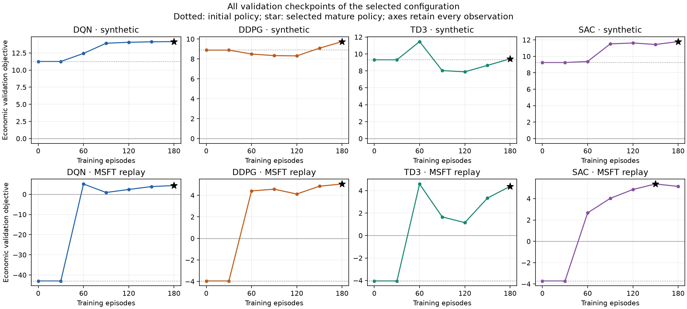
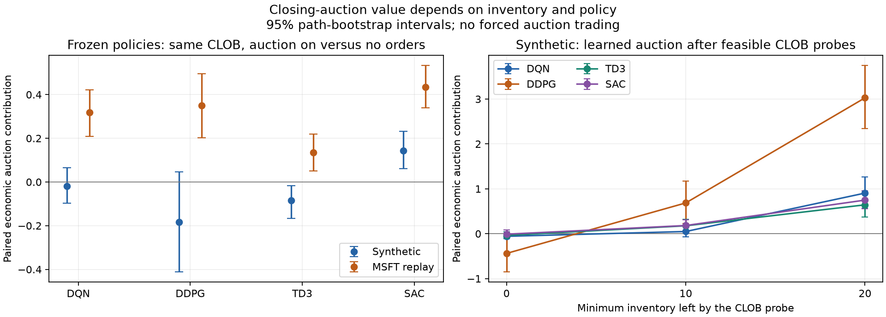

The [v17 refinement](model_refinement_v17.md) updates DDPG/TD3 preprocessing and expands the calibration audit. The results below remain the frozen v16 evidence.

# Objective and learning repair — 5 September 2026

The active configuration now trains on the author-approved weighted shaped
objective and evaluates on economic risk-adjusted PnL. All four selected
learners have positive PnL in synthetic and MSFT replay checks. Historical
reference rankings have improved, DDPG's late collapse is absent in the final
bounded checks, and the learned auction controllers show both liquidity
provision and conditional inventory-risk reduction. Neither protected TeX
file was edited.

This is a repair of the systematic incentive, accounting and learning-scale
failures. It is **not** evidence that every algorithm dominates AS, that
training is monotone, or that the auction is always beneficial. The final
synthetic DDPG and TD3 comparisons with AS are statistically unresolved.
TD3's small negative synthetic auction contribution is retained below.

## Frozen-policy confirmation

The final configuration was trained for 180 episodes per learner, with
64 common validation paths every 30 episodes and maturity thresholds of
5000 CLOB / 2000 auction updates. These are development checks, not the
800-episode production matrix. After freezing the settings and checkpoints,
`confirm_saved_policies.py` evaluated **256 fresh common development paths**
per setting, with no optimization or checkpoint selection on those paths.
Training master seeds were 628 for synthetic and 627 for MSFT replay.

| Policy | Synthetic PnL | Synthetic economic objective | MSFT PnL | MSFT economic objective |
|---|---:|---:|---:|---:|
| DQN | 11.430 | 11.054 | 5.363 | 4.856 |
| DDPG | 9.912 | 8.599 | 6.560 | 5.334 |
| TD3 | 9.126 | 8.407 | 5.503 | 4.821 |
| SAC | 10.054 | 9.672 | 6.820 | 6.025 |
| AS | 8.502 | 8.495 | -1.123 | -1.127 |
| TWAP | 2.073 | 2.032 | -0.950 | -0.992 |

Values are model price × inventory units. With initial notional 10000,
these numbers also equal basis points of initial notional. Economic objective
means PnL minus lambda times squared terminal inventory, never shaped return.

Paired 95% path-bootstrap intervals for the synthetic differences from AS
are DQN **[1.688, 3.416]**, DDPG **[-1.077, 1.245]**, TD3
**[-1.242, .899]**, and SAC **[.626, 1.699]**. All four historical differences
are positive, with intervals entirely above zero; every learner also exceeds
TWAP in both settings. There is no basis for asserting DDPG/TD3 superiority
over AS in the synthetic setting. Fitting a configuration until that ordering
is guaranteed would undermine the comparison.

The [complete fresh records](verification_v16/frozen_records.csv),
[means and intervals](verification_v16/frozen_summary.csv), and
[frozen-checkpoint protocol](verification_v16/frozen_protocol.json) are saved.
Historical confirmation uses the five validation dates, August 17–21, with
simulated order flow; it does not consume the final test dates. These intervals
describe path variation conditional on the fitted policies and those dates,
not independent training-seed uncertainty or all-stock generalization.

## What caused the pathology and what changed

The original fictive auction sale credit counted approximately another full
share price per projected sale, although actual sale principal cancels
against the residual mark. Locally, after liquidation, an extra sale z had
economic increment approximately `-lambda*z²` but shaped increment
`S*z-lambda*z²`. Neither k-star nor q removes this positive-sale incentive.
Earlier feasible-policy counterexamples and failed literal-J runs remain in
the [prior audit](calibration_followup.md).

The approved correction multiplies fictive submission credits, their exact
original cancellation clawbacks, and terminal purchase shaping by
`auction_shaping_weight=.0001=alpha/S0`. Actual cash, fees, risk and clearing
are unchanged. The local sale credit is now .01 per unit, and the local
excess-sale stationary point is .5 inventory units at lambda=.01. This reduces
the incentive conflict; it does not make shaped J equal to the economic
objective. The exact review patch calls the weight `omega_sh`, avoiding both
the manuscript's cancellation indicators and its learned DQN action bias.

The learning changes address distinct numerical problems:

- Headline objective shaping is separated from economic reporting and model
  selection. The terminal reward enters once; CLOB junction targets continue
  through the auction network. Residual inventory is marked at the frozen
  exogenous midpoint, not the agent-influenced clearing price.
- A common observable-state potential exposes liquidation value and deadline
  risk. Its increments telescope. A frozen deterministic inventory reference,
  fitted on training calibration paths, removes the same exogenous price
  return from every policy on a common path. This remains policy independent
  in historical replay without assuming historical returns have zero mean.
- Relative-price coordinates and the invertible auction residual/displacement
  transform retain the same 18 raw observations. Normalization and the
  inventory reference are frozen before learning and restored with checkpoints.
- The first 32 exploration episodes cross persistent sales, purchases,
  cancel/replace behavior and abstention with different CLOB inventory paths.
  The earlier small replay warm-up allowed auction optimization before that
  coverage was present. Auction learning now starts at 960 stored transitions;
  the CLOB threshold is 2500. No benchmark actions or optimizer labels enter
  the training data.
- All four methods use two 256-unit hidden layers, one-step replay, scale 1,
  batch size 128, one update per realized step and gradient norm limit 1.
  Initial learning rates share the fixed factor `max(.1, 2**(-episode/90))`.
  DDPG's actor uses the manuscript rate .0001; its critic and the TD3/SAC
  networks start at .0003. DQN starts at .00015. No critic weight decay is active.

DDPG, TD3 and SAC use **Stable-Baselines3 2.7.1**. Losses, backward passes,
target synchronization, TD3 smoothing/delay and SAC entropy updates remain
the library's implementations. Optimizer hooks apply the stated norm limit
and DDPG actor rate; the replay adapter supplies the cross-phase continuation.
[Primary library documentation](https://stable-baselines3.readthedocs.io/en/v2.7.1/modules/ddpg.html).

The larger replay warm-up and slower DDPG actor were checked in both settings.
In the final DDPG validation sequence, episodes 120/150/180 score
**8.31/9.08/9.74** synthetically and **4.12/4.85/5.05** historically. This
replaces the earlier negative late collapse with positive late improvement
in these bounded checks. It does not prove stability through episode 800.



All final selected checkpoints improve on their respective initial policy's
economic validation score. The active trainer now enforces that condition
in addition to maturity. Applying the gate to the saved validation records
leaves every final checkpoint unchanged. Selection failure is reported if no
candidate qualifies; the gate does not require beating a reference benchmark.

## The closing auction's measured role

Paired auction contributions hold the learned CLOB policy fixed and compare
its auction actions with no auction orders, on exactly the same paths.
They are distinct from the separately retrained no-auction treatment.

| Learner | Synthetic contribution | MSFT contribution | MSFT 95% interval |
|---|---:|---:|---:|
| DQN | -.020 | .318 | [.210, .421] |
| DDPG | -.183 | .349 | [.202, .496] |
| TD3 | -.084 | .135 | [.051, .220] |
| SAC | .142 | .434 | [.339, .533] |

The historical gains are about 3–7% of total economic performance. They arise
despite mean opening inventory of only 2.5–2.9 units. All four historical
controllers are net **buyers** at the auction: the signed action set permits
profitable liquidity provision below the frozen midpoint as well as
liquidation. Reporting only signed mean sales would miss that role.

Synthetic effects differ. SAC's gain is positive on the fresh paths; DQN's
and DDPG's intervals include zero. TD3's interval is [-.166, -.016], a small
but detectable economic cost of its learned auction behavior. That is a
policy-performance finding, not an accounting correction to conceal.

To assess inventory-risk reduction, a separate diagnostic lets a feasible
fixed CLOB policy leave approximately 0, 10 or 20 units, then hands the actual
observed auction state to the frozen learned controller. It imposes no
auction trade and no fill bound. With approximately 20 units left in the
synthetic setting, auction access improves the economic objective by
**.906 (DQN), 3.027 (DDPG), .644 (TD3), and .749 (SAC)**. DDPG executes about
13.2 units there; approximately 2.39 of its gain is reduced inventory risk
and .64 is improved PnL. These are conditional diagnostics, not headline
returns or evidence that deliberately reserving 20 units is optimal.



[Conditional records](verification_v16/inventory_records.csv),
[paired decompositions](verification_v16/inventory_probes.csv), and their
[protocol](verification_v16/inventory_protocol.json) retain negative cases too.
Expected exogenous CLOB buy flow is about 397 units for an initial 100-unit
position. There are roughly 76 strategic CLOB decision intervals, not 120
independent order opportunities: the irregular clock waits on both sides of
flow. Neither the arrival count nor the unconditional volume is a guarantee
of executable capacity. Artificially forcing auction reservation would
change the control problem and has not been done.

## Calibration and units

| Parameter | Active value | Defensible interpretation |
|---|---:|---|
| alpha | .01 | One model tick; the best quoted spread is 2 bps at S0=100. |
| k-star | 10000 | Local forgone-price deduction coefficient S0/(k-star alpha)=1. A training preference, not a measured tolerance. |
| q | 0 | No purchase subsidy in the shaped objective; actual purchases are paid in full. |
| omega_sh | .0001 | About one tick of fictive credit per projected inventory unit. |
| lambda | .01 | A 10% residual costs one tick on the initial position: .01 × 10²=1. |
| beta | .25 | Inventory units per price unit; slope cap 8, still 33 slope levels. |
| d | .001 | Stylized withdrawal cost; the final decision's cancellation fee is .029. |
| Exogenous slope support | [1,20] | Stylized new-schedule liquidity, additional to converted CLOB liquidity. |

At a one-tick gap the slope quantum offers .0025 inventory units; a
maximum-slope ten-tick schedule offers .8, and 30 persistent schedules offer
24 nominal units. These are **not hard fill bounds**: indicative-price motion,
price impact, rounding and pro-rata allocation affect actual execution.
The [dimensional audit](verification_v16/calibration.json) records every scale.

Training-only median daily quote spreads are CAT 5.6275, GOOGL .8679,
JPM 2.0769, MSFT 1.4095 and PG 1.3842 bps. The shared 2-bp model spread is
defensible as a stylized common scale, not an exact fit to every stock.

The quote-size audit found a real provenance-label error: the frozen sidecar
calls its August 2026 sizes round lots, but Alpaca switched CTA/UTP quote
sizes to **shares on November 3, 2025**. The numbers must not be multiplied
by a lot size. The original data and metadata are preserved with an erratum;
future regeneration uses neutral field names, dated units and schema 4.
This label error never affected the midpoint paths or learning experiments.
[Alpaca's dated announcement](https://docs.alpaca.markets/us/v1.1/changelog/marketdata-bid-and-ask-size-display-change).

The pooled training median of daily selected best-quote sizes is 80 shares.
The model top-depth median is .5289 inventory units, so approximately
**150 shares per model inventory unit** is an illustrative top-depth
normalization (the exact ratio is 151.26). Under that convention I0 is about
15000 shares and a maximum ten-tick auction schedule offers about 120 shares.
This provides a dimensional interpretation of beta without claiming that
the simulated flow is the whole SIP tape. It is one depth-scale anchor, not
an empirical fit of full depth, trade flow, price impact or auction slopes.
The [extract and provenance](verification_v16/quote_calibration_provenance.json)
use only the ten training dates.

No available closing-auction imbalance/volume data identifies the exogenous
slope support. It would be incorrect to describe k-star, q or beta as fitted
exchange parameters. Similarly, Nasdaq's reported 17% Closing Cross share of
2025 market volume does not imply that an individual parent should reserve
17%. [Nasdaq](https://www.nasdaq.com/products/north-american-markets/nasdaq-stock-market/closing-cross).
The model's 30-minute call remains stylized; real entry cutoffs and late order
concentration differ. [NYSE timing study](https://www.nyse.com/research/insights/nyse-closing-auction-timing-shifts-and-marketability-trends).

## Evidence, reproduction and exact manuscript recommendations

The [development ledger](verification_v16/all_attempts.csv) contains all 57
completed learning diagnostics in `results/revised_objective`, including
failed liquidity restrictions, reward scales, optimizer recipes and smaller
networks. The [full validation ledger](verification_v16/all_validation.csv)
retains every recorded regression. Earlier calibration cohorts were reused
during exploration; only the last 256-path confirmation was collected after
the final settings and checkpoints were frozen. No final-test paths or full
production runs were used.

Active commands and production safeguards are in [REPRODUCING.md](../REPRODUCING.md).
Use `--resolved-config path/to/config.yaml` with `diagnose_learning.py` to
reconstruct an earlier complete configuration without inheriting new base
defaults. The saved protocols record seeds, package versions, configurations,
source hashes and checkpoint hashes. Rebuild the review material with:

```sh
.venv/bin/python scripts/summarize_objective_repair.py
.venv/bin/python scripts/audit_quote_calibration.py
.venv/bin/python scripts/recommend_manuscript.py
git apply --check docs/manuscript_recommendations_v16.patch
```

The [exact unapplied patch](manuscript_recommendations_v16.patch) replaces the
auction shaping definition and terminal shaping weight; clarifies k-star,
q and units; specifies preprocessing, replay conditioning, warm-up and
library methods; and updates the hyperparameters and protected parameter
table. It supersedes the earlier alternative patches. Neither protected file
is written by its generator. Do not copy development performance into the
paper as final publication results.

Tests cover actual economic accounting, weighted signed clawbacks, phase
junctions, training-only normalization/reference fitting, continuous/discrete
warm-up execution parity, economic selection, matched treatment controls,
native SB3 updates and exact next-episode resume for all four methods with
the new conditioning enabled. The frozen quote-data checks also cover the
dated SIP unit change and reject pooling sizes across incompatible units.

The final local suite (`.venv/bin/python -m pytest -q -m 'not network and
not slow'`) passed **527 tests**, with 23 deselected and 14 warnings.
The manuscript patch passes `git apply --check`, and `git diff --check`
reports no whitespace errors. SHA-256 verification confirms that both
protected TeX files and the frozen quote sidecar retain their original bytes;
the values and check results are recorded in
[verification status](verification_v16/verification_status.json).
