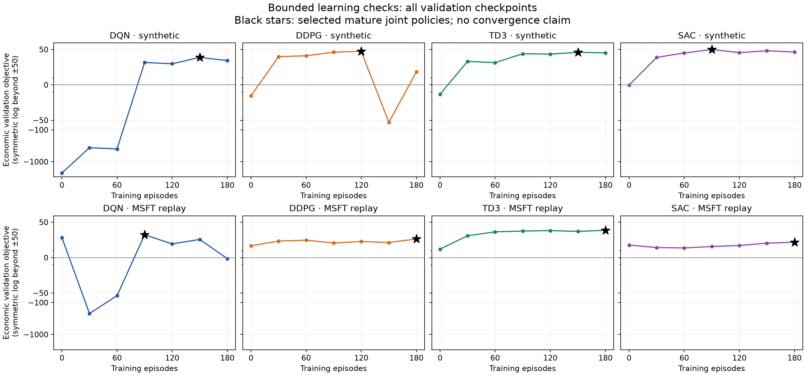

> Historical v15 report. The current configuration, authorization and evidence are in [the v16 report](objective_repair_v16.md).

# Learning pathology repair and bounded evidence

**Follow-up:** [calibration_followup.md](calibration_followup.md) identifies
an unresolved auction-reward incentive conflict and limits on the v15
calibration's empirical interpretation. It supersedes any implication below
that positive selected-policy means establish a completed pathology repair
or a realistic publication calibration.

The active implementation now trains the headline on centered manuscript J
and selects/evaluates policies on the economic criterion, bar-J-lambda.
All four selected policies have positive mean PnL and positive mean economic
objective in the bounded synthetic and MSFT checks. On the synthetic paths,
all four exceed both stylized references in mean economic objective. This is
development evidence for usable learned policies, not proof of convergence or
universal benchmark superiority. Historical rankings and late deterioration
are reported below rather than filtered out.

Neither `paper/main.tex` nor
`paper/results/tables_params/params_generative.tex` was edited. Exact proposed
changes are in [the unapplied patch](manuscript_recommendations.patch), with
a [location guide](manuscript_recommendations.md).

## What the project implements

One shared simulator generates a realized decision clock over 120 minutes of
one-sided CLOB liquidation, followed by a 30-minute two-sided call auction.
The historical setting replaces the exogenous midprice source; order flow,
liquidity and clearing are still simulated. The auction midprice is frozen at
opening. The indicative clearing estimate is lagged and observable.

DQN selects among 391 CLOB and 1,346 cancellation-enabled auction actions.
The other methods propose continuous normalized coordinates, which are
projected onto the same executable controls. Two phase-specific value models
are joined by an auction continuation at the last CLOB transition. Multiple
signed auction schedules can remain live. Cancel-all removes older schedules
and claws back their original shaping credits. Clearing uses the actual tick
price and pro-rata signed allocation, including admissible negative terminal
inventory. Those mechanics and the original continuous proposal projection
remain intact.

AS and TWAP are deterministic policies on stochastic market paths. Their
auction references are capped positive-part schedules; they are stylized
comparators, not optimal policies or members of precisely the learner's
signed-schedule class. The AS order-book impact regression is independently
seeded. Evaluation uses common exogenous random numbers across policies.

## Diagnosis

The saved v12 synthetic headline evaluations give these approximate means
over five master seeds and 100 evaluation episodes per seed:

| Policy | PnL | Economic objective | Cancellation fees |
|---|---:|---:|---:|
| DQN | -11.26 | -78.88 | 14.62 |
| DDPG | -1.98 | -4.97 | 6.14 |
| TD3 | -12.97 | -21.33 | 18.55 |
| SAC | -12.47 | -25.82 | 17.92 |
| AS | 7.46 | 5.31 | 0 |
| TWAP | -0.58 | -8.13 | 0 |

Several mechanisms compounded each other:

1. **The headline configuration was unshaped.** The existing economic
   evaluation helper already disabled shaping. The required repair was to
   enable J in headline training, preserve economic selection/evaluation,
   and remap the treatment matrix and reporting consistently. It would be
   inaccurate to attribute the entire failure to an erroneous evaluation
   cash-flow formula.
2. **The original shaped objective can reward bad economic behavior.**
   With q=1, purchase cash can be offset by shaping. Fictive submission
   credits survive on uncanceled schedules even when actual terminal fills
   differ. In the old shaped treatment, mean economic objectives were roughly
   -961 for DQN, -1724 for DDPG and -2317 for TD3. These are properties of the
   objective and exposure scale, not cash that can be reported as PnL.
3. **Auction exposure was coarse relative to remaining inventory.**
   The old per-schedule slope cap was 32, with many schedules potentially
   surviving. Yet typical successful CLOB policies sold about 99 of 100
   shares before the auction. Large accumulated exposure, quadratic terminal
   losses and repeated cancellation fees overwhelmed small execution edges.
4. **Important differences were poorly conditioned.** Gross weighted quotes
   contain a large midprice-times-slope component. Random calibration paths
   canceled about half the time and poorly represented persistent schedules.
   Saturated no-order auction actor initialization, delayed inventory losses,
   tiny replay rewards and SAC's initial entropy scale further impeded useful
   learning. The conditioning and initialization findings are supported by
   code inspection and development trials; the trials do not isolate a causal
   effect size for each intervention.

There was no justification for adding a hidden auction inventory cap, changing
the signed control problem, granting benchmark executions to learners, or
counting fictive credits as PnL. None of those changes was adopted.

## Adopted repair

The exact executable contract is in [rl_design.md](rl_design.md).

| Parameter | v12 | Active v15 | Reason |
|---|---:|---:|---|
| Tick alpha | 0.01 | 0.05 | Stylized regime with a meaningful execution edge |
| Auction lattice beta | 1 | 0.002 | Resolve small residual positions; retain all 33 levels |
| Inventory penalty lambda | 2 | 0.5 | Balance execution proceeds against residual risk |
| Purchase subsidy q | 1 | 0 | Remove purchase subsidy while retaining other J shaping |
| CLOB tolerance k-star | 1,000 | 100,000 | Reduce distortion from the CLOB multiplier |
| Replay reward scale | 0.001 | 0.01 | Condition updates without changing reported money |
| Phase hidden layers | 128,128 | 64,64 | Common compact architecture |
| Phase replay warm-ups | 2,000 / 512 | 512 / 256 | Begin updates within bounded development budgets |

The new slope cap is 0.064 per schedule. At a price difference of 0.50, one
maximum-slope schedule represents about 0.032 shares, and 30 such schedules
represent about 0.96 shares before market interaction and rationing. This is
the residual-inventory scale the original market flow creates. The terminal
quadratic penalty, signed positions and cancellation fees remain active.

These parameter changes define a **different numerical calibration**, not an
objective-preserving transformation of the v12 market. In particular, the
five-cent tick is illustrative; MSFT results must be described as historical
midprice replay in a stylized larger-tick market, not empirical exchange-spread
or auction-depth calibration. The before/after PnL levels are consequently not
a controlled estimate of a software fix alone. Parameters are shared across
methods, settings and matched treatment arms.

The numerical transformations themselves preserve the specified complete
return. Relative-price coordinates retain midprice and slope information.
A training-only potential redistributes the centered J rewards and is zero
at termination. It values CLOB inventory at current midprice displacement,
then uses an observable continuous-root auction exposure estimate during the
call. It changes neither actual allocation nor the economic objective.
Across the eight recorded checks, the largest complete-episode telescoping
error was below 1e-12 currency units.

DQN retains the original rank-32 structured Q architecture and uses MSE,
five-step replay truncated at phase boundaries, and a fixed exploration
schedule ending at epsilon=0.05 after 95 episodes. Its sampled multi-step
continuations are an off-policy approximation without importance correction.
DDPG, TD3 and SAC use pinned Stable-Baselines3 2.7.1, standard native losses,
one-step replay and a small phase-boundary replay adapter. All three share
64x64 networks, learning rate 0.0003 and actor/critic gradient norm bound 1.
There is no benchmark imitation or auction actor saturation prior. The native
algorithm distinctions remain: one critic for DDPG, clipped double-Q/delayed
updates for TD3, and automatic entropy adjustment for SAC, initialized at
0.001 in replay units.

Joint checkpoints are selected using economic validation after at least
5,000 CLOB and 2,000 auction optimizer updates. The initial network is a
diagnostic comparator. No profitability or benchmark-win filter chooses which
mature runs are reportable; such a filter would bias comparative research.

## Bounded verification

The final recorded checks use 180 training episodes per method, the unchanged
physical horizon, 64 validation paths every 30 episodes, and 128 separate
development confirmation paths. Master seed 615 supplies the synthetic check;
616 supplies the MSFT check. Every selected checkpoint passes the production
phase-maturity gates. These development seeds are outside the publication
seed matrix. The diagnostic never uses the production final-test RNG stream.
Historical confirmation resamples paths from the validation date partition;
it does not introduce another held-out date partition.

The entire repair investigation contains **48 completed bounded trials and
7,380 training episodes**, including rejected approaches and reruns. No
800-episode production run or full publication matrix was launched. These
were iterative development experiments, and their confirmation results have
been inspected during development. They must not be promoted to untouched
publication-test evidence. Rejected trials remain under
`results/pathology_diagnostic_20260905`; they included alternative DQN heads,
a CLOB quadratic-potential baseline, common multi-step continuous replay, and
inventory-scaled proposal coordinates. Those changes were discarded. The final
continuous hyperparameters are shared except for the algorithms' usual
target, delay and entropy distinctions.

### Synthetic confirmation

| Policy | PnL | Economic objective | Paired difference vs AS, 95% interval |
|---|---:|---:|---:|
| DQN | 44.98 | 42.25 | 1.22 [-3.83, 4.51] |
| DDPG | 49.57 | 43.18 | 2.16 [-9.44, 8.71] |
| TD3 | 49.10 | 47.30 | 6.28 [2.49, 8.81] |
| SAC | 52.11 | 45.66 | 4.64 [-3.89, 10.56] |
| AS | 41.38 | 41.02 | — |
| TWAP | 4.97 | 2.85 | — |

### Historical MSFT confirmation

| Policy | PnL | Economic objective | Paired difference vs AS, 95% interval |
|---|---:|---:|---:|
| DQN | 41.95 | 20.37 | -13.05 [-29.80, 0.76] |
| DDPG | 28.28 | 28.11 | -5.30 [-6.90, -3.57] |
| TD3 | 39.00 | 37.94 | 4.52 [2.57, 6.27] |
| SAC | 21.38 | 21.25 | -12.16 [-13.59, -10.58] |
| AS | 34.35 | 33.41 | — |
| TWAP | 0.12 | -2.46 | — |

Intervals are percentile bootstraps of 128 paired episode differences,
10,000 resamples. They condition on a single trained policy per setting and
do not measure training-seed variability or adjust for development selection.
Only TD3's episode-level interval excludes zero in favor of the learner in
both checks. DQN's historical residual-inventory RMS is 6.57 shares, despite
mean residual inventory of 1.99; its risk-adjusted performance must not be
inferred from its relatively high PnL alone.

All methods improve their average shaped training return between the first
and last 30 training episodes. This does not imply monotonic economic
improvement. In particular, synthetic DDPG's validation objective falls from
47.36 at episode 120 to -58.10 at 150 and recovers to 18.18 at 180. Its selected
mature checkpoint is episode 120. Historical DQN also deteriorates late.
Common gradient clipping prevented the previously observed total CLOB
abstention collapse in historical DDPG, but did not eliminate every economic
tail or regression. TD3's stronger stability is part of the algorithm
comparison. It would be false to claim that all four final iterates converge
or that every seed must outperform AS.



### What the auction contributes

A paired counterfactual preserves each trained policy's CLOB decisions and
sets all its auction actions to no-order. The CLOB executed quantities are
verified identical path by path. This measures direct execution/fee/penalty
effects of auction participation, not the value of retraining without an
auction or the total value of anticipation.

| Policy | Synthetic opening inventory | Synthetic signed auction fill | Synthetic objective gain from auction | MSFT objective gain |
|---|---:|---:|---:|---:|
| DQN | 0.841 | 0.326 | 0.316 | -0.306 |
| DDPG | 0.904 | 0.936 | 0.421 | -0.072 |
| TD3 | 0.737 | 0.941 | 0.130 | 0.164 |
| SAC | 1.117 | 0.853 | 0.593 | -0.034 |

The auction is a residual-risk and final-execution opportunity here, not the
dominant liquidation venue. Some signed policies slightly oversell; the
quadratic penalty prices this risk. DQN and SAC have positive synthetic
auction-gain intervals; DDPG and TD3 intervals include zero. Historical
intervals all include zero. Full intervals and PnL/penalty effects are in
[summary.csv](verification/summary.csv). A claim of large or universally
positive auction value is unsupported by this calibration.

Reducing beta also reduces the common reference schedule cap. A sensitivity
check gives the references their old cap of 32 while keeping the revised
environment and exactly the same calibrated AS CLOB quotes. AS's economic
score changes from 41.023 to 41.107 (synthetic) and 33.413 to 33.503 (MSFT).
Thus the synthetic mean ranking is not explained by restricting AS's auction
slope. The complete sensitivity records are retained separately.

The production no-auction treatment also removes H and shaping, so its
contrast is explicitly a bundled treatment. The H-by-shaping matrix now reuses
the shaped headline cell and trains H-on/shaping-off separately. No-cancellation
retains headline shaping. Publication aggregation verifies matched configs and
paired episode seeds; it cannot combine stale v12 artifacts with v15 runs.

## Reproducibility and checks

- [confirmation.csv](verification/confirmation.csv): all final development
  policy and reference episodes.
- [validation.csv](verification/validation.csv): every validation checkpoint,
  including untrained policies and late deterioration.
- [training.csv](verification/training.csv): training economic and shaped
  returns, control-variate totals and loss diagnostics.
- [manifest.json](verification/manifest.json): selected episodes, original run
  paths, seeds, source hashes and checkpoint/artifact digests.
- `scripts/summarize_learning_diagnostic.py` regenerates the tables and figure
  from saved artifacts without stepping the simulator.

The final selected runs' simulator, algorithm, feature and reward config
sections match the active checked-in configuration. Original bounded trials
used Gymnasium 1.3.0. The installation was subsequently corrected to supported
Gymnasium 1.2.3 (`>=1.2,<1.3`); 59 integration/acceptance tests passed on that
supported version, followed by 52 tests covering the final logging, resume,
determinism and reporting changes. The standard SAC smoke was repeated on
1.2.3 and produced exactly identical evaluation records to the 1.3.0 smoke.
Gymnasium supplies spaces/wrappers, while the shared custom loop owns market
interaction.

Validation completed:

- 493 tests passed, 23 slow/network tests deselected.
- Native SB3 phase junction and terminal rewards are included exactly once.
- Native optimizer updates after save/load reproduce the next update exactly
  for DDPG, TD3 and SAC, including stochastic Torch/replay state.
- Loaded optimizers reinstall and enforce the configured gradient norm bound.
- Reward telescoping, treatment accounting, projection, chronological
  information, pro-rata conservation and non-clipped auction inventory pass.
- Standard SAC launcher smoke completed training, checkpoint loading,
  economic evaluation, paired differences and completion-manifest binding.
  Its four-episode output is a pipeline check, not learning evidence.
- `pip check`, `git diff --check`, and the unapplied manuscript patch check pass.

Protected-file SHA-256 values remain:

```
paper/main.tex
0d685ea8277d995d5e601ddd826c650205768e142b6704d02e1b43da74eba835
paper/results/tables_params/params_generative.tex
13e0b2ebad46b2b33b0fbcbf3785fe3f259cec01105c979c0969f874caa4ca88
```

The supported conclusion is that the universal v12 loss outcome has been
replaced by profitable, economically accounted, maturity-selected learned
policies in bounded development checks. Broad convergence, cross-seed
dominance, generalization to every historical asset and a large auction
benefit remain empirical questions for the pre-specified publication matrix.
